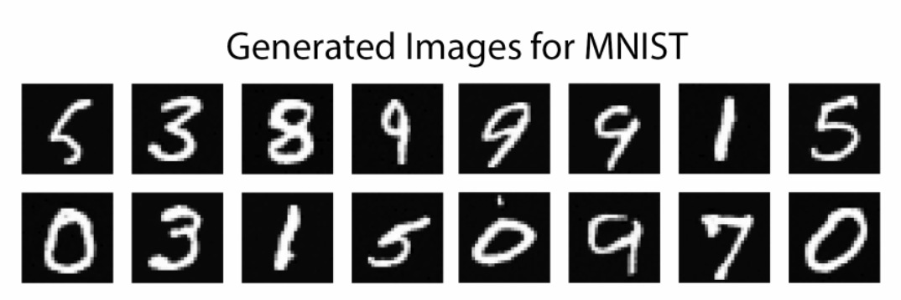
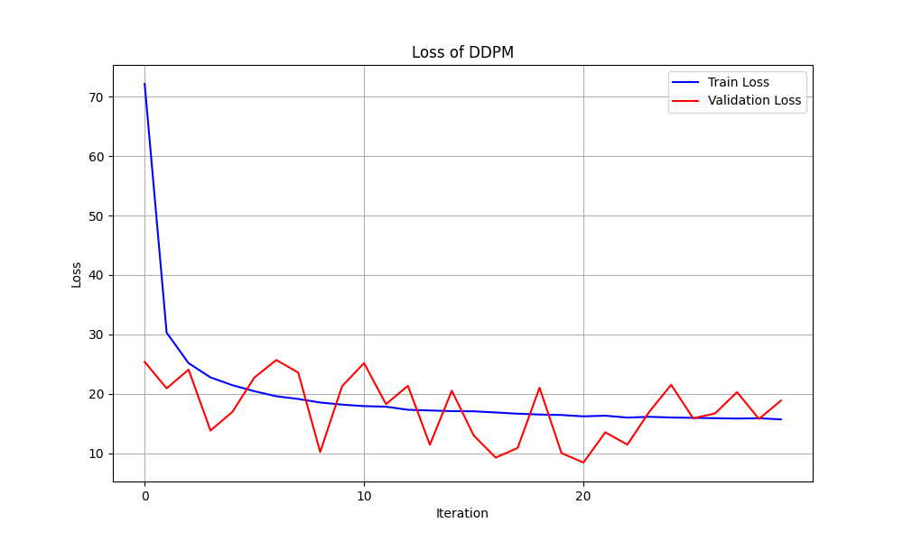
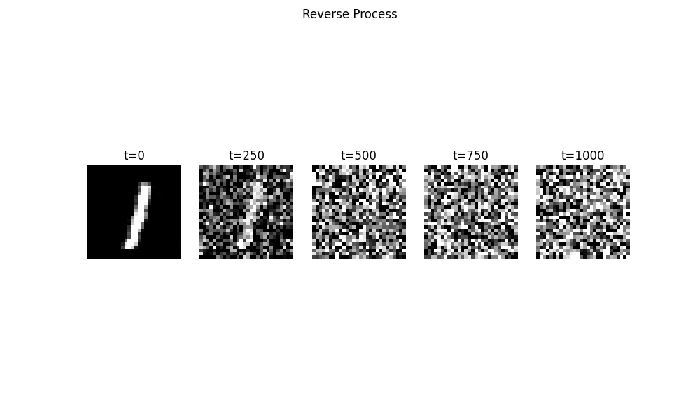
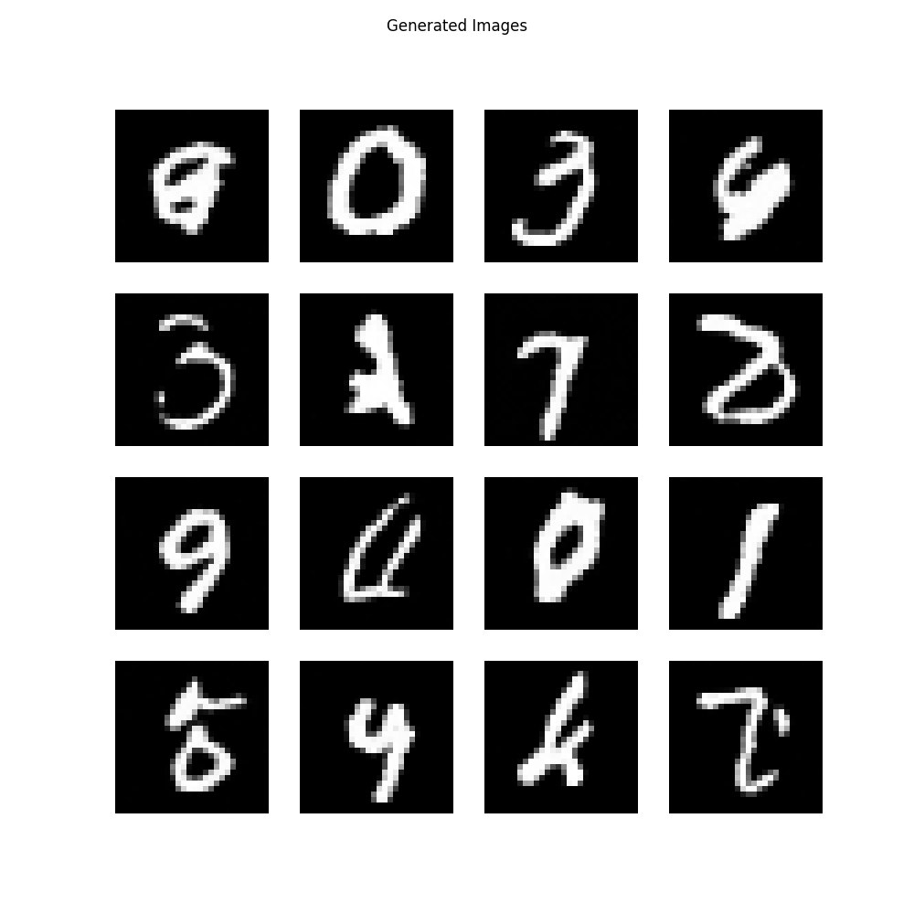

# 02456_Group_44_DDPM_Project



This repository contains a project implemented by a group of university students at the Technical University of Denmark (DTU). The aim of the project is to re-implement the Denoising Diffusion Probabilistic Model (DDPM) in PyTorch and reproduce their results at least on MNIST and ideally on CIFAR-10. This paper is the one that kicked off the diffusion movement, it is a great way to learn what diffusion is all about and have hands-on experience. Link to paper: https://arxiv.org/abs/2006.11239.

# Repository Structure
```
├── docs                    # Documentation, explanation of concepts
├── results                 # Logs, images, plots, generated by models during training
├── resources               # Resources used for README.md
└── src                     # source code
    ├── dataset.py              # Dataloader, Dataset
    ├── diffusion_model.py      # Diffusion model adaptable to a custom architecture
    ├── generator.py            # Generate samples from a trained Diffusion model
    ├── logger.py               # Log training steps, save best model, plot
    ├── main.py                 # Main code
    ├── metrics.py              # Inception and FID score calculation
    ├── mnist_guidance.py       # MNIST classifier guidance for generating specific digits
    ├── objective.py            # Noise loss objective in PyTorch format
    ├── postprocessing.py       # Script to calculate Inception/FID score after training
    ├── schedule.py             # Noise schedules (linear, cosine) to generate variance
    ├── trainer.py              # Model training
    ├── unet.py                 # Base architectures and blocks (UNet, CNN, ResNet)
    ├── utils.py                # Extra functions (normalize, upsample, time embeddings, etc.)
    └── visualizer.py           # Plot generation, model outputs, etc.
├── requirements.txt        # Pip package dependencies
```
# Prerequisites
To be able to run the scripts in the repository, an environment with all the dependencies of `requirements.txt` is needed.

# Running the scripts
### Python
To run the script, call `main.py` via your python interpreter. The following optional arguments are supported:
```bash
python src/main.py [ARGS]

List of Arguments:
  -h, --help            show this help message and exit
  --data_type {mnist,cifar10}
                        Dataset to use: 'mnist' or 'cifar10'
  --schedule {linear,cosine}
                        Schedule type: 'linear' or 'cosine'
  --attention {attention,noattention}
                        Attention type: 'attention' or 'noattention'
```
### Jupyter Notebook
Alternatively, you may replicate our results via the Jupyter Notebook at `TBD`, which can be used to plot and sample from an already trained model.

# Results
## MNIST
### Training Loss:



### Reverse Process


### Generated Images

